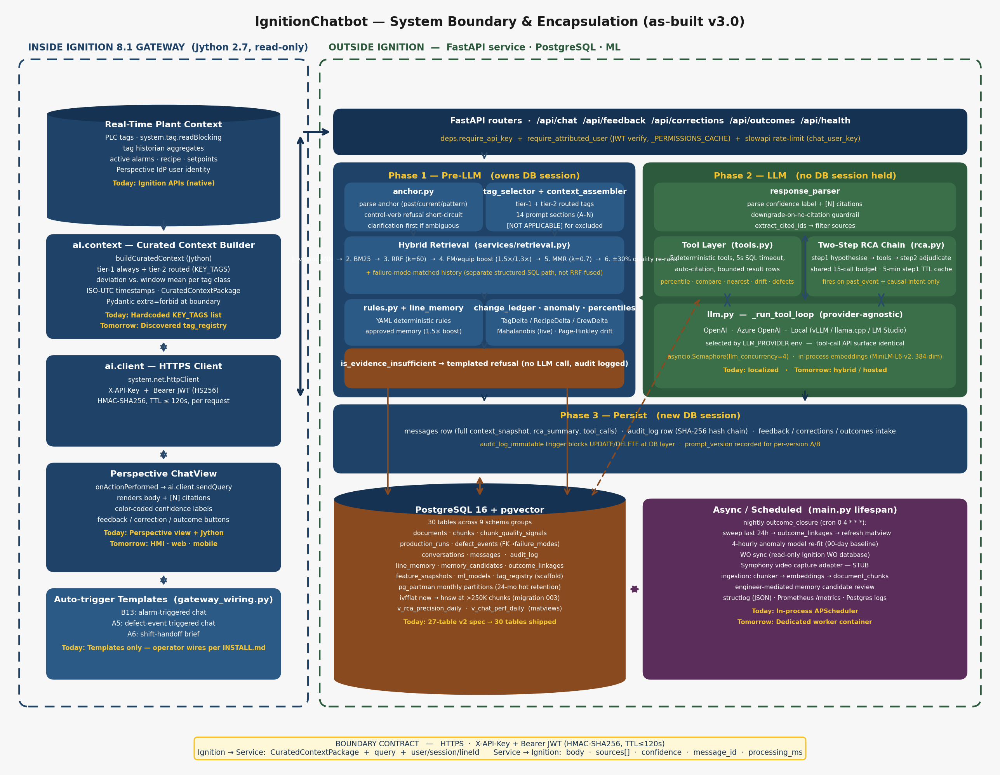

# System Boundary & Encapsulation

> Companion to [`architecture.md`](architecture.md). The original conceptual
> diagram (Domain Knowledge / OT Analytics / Real-Time Data / Agentic Harness
> / Standardized Data Products / Complex Inferencing / AI Services /
> Interface) is **correct as a reference model**. This document re-draws it
> against the system we are actually building so that it is unambiguous what
> runs **inside Ignition** versus **outside Ignition**, and what crosses the
> boundary.



---

## 1. The boundary in one picture

The diagram above maps every load-bearing component to a side of the
boundary and shows the three phases of the request lifecycle in
[`service/services/rag.py`](../service/services/rag.py):

- **Phase 1 — Pre-LLM** owns its own DB session and runs anchor parsing,
  hybrid retrieval, rules, change ledger, anomaly, and context assembly.
- **Phase 2 — LLM** holds **no DB session**. The provider-agnostic
  `_run_tool_loop` in [`service/services/llm.py`](../service/services/llm.py)
  calls OpenAI / Azure / a local OpenAI-compatible endpoint, and the
  two-step RCA chain in [`service/services/rca.py`](../service/services/rca.py)
  fires only when the anchor is `past_event` and the query has causal
  intent.
- **Phase 3 — Persist** opens a fresh DB session, writes the `messages`
  row with the full `context_snapshot`, and chains the `audit_log` row's
  SHA-256 hash. The DB-layer `audit_log_immutable` trigger blocks any
  later UPDATE/DELETE.

```
┌─────────────────────────────────────────────────────────────────────────┐
│  INSIDE IGNITION 8.1 GATEWAY  (Jython 2.7, read-only, on-prem)          │
│                                                                         │
│   Perspective ChatView ──► ai.client.sendQuery                          │
│                                  ▲                                      │
│                                  │ uses                                 │
│   PLC tags ─┐                    │                                      │
│   Historian ├──► ai.context.buildCuratedContext ──► CuratedContextPkg   │
│   Alarms   ─┘                                                           │
│                                                                         │
│   ai.config: tag paths, API_KEY, GATEWAY_HMAC_SECRET, LINE_ID           │
└──────────────────────────────────────┬──────────────────────────────────┘
                                       │  HTTPS
                                       │  X-API-Key  +  Bearer JWT (HMAC)
                                       │  body = CuratedContextPackage + query
                                       ▼
┌─────────────────────────────────────────────────────────────────────────┐
│  OUTSIDE IGNITION  —  FastAPI Service  (Python 3.11, Docker)            │
│                                                                         │
│   /api/chat  /api/feedback  /api/corrections  /api/outcomes  /api/health│
│        │                                                                │
│        ▼                                                                │
│   RAG Orchestrator  ─►  retrieval ─► rules ─► context_assembler         │
│                                          │                              │
│                                          ▼                              │
│                                        LLM  ─►  response_parser         │
│                                                       │                 │
│                                                       ▼                 │
│                                                    audit_log            │
│                                                                         │
│   Analytics: anomaly · deviation · RCA · failure_mode_classifier        │
│   ML:        embeddings · reranker · LLM client                         │
└──────────────────────────────────────┬──────────────────────────────────┘
                                       │  asyncpg
                                       ▼
┌─────────────────────────────────────────────────────────────────────────┐
│  OUTSIDE IGNITION  —  PostgreSQL 16 + pgvector                          │
│  27 tables: documents · document_chunks · line_memory · business_rules  │
│  conversations · messages · audit_log · feedback · corrections · …      │
└─────────────────────────────────────────────────────────────────────────┘

         ▲                                            ▲
         │ offline ingest                             │ engineer review
         │                                            │
   Domain docs / SOPs / OEM manuals             /api/corrections
   (markdown, PDF) → service/scripts/ingest.py  workflow → line_memory
```

---

## 2. What is **IN** Ignition (and stays there)

| Capability                             | Implementation                          |
|----------------------------------------|-----------------------------------------|
| Live OT integration (tags, history)    | `system.tag.readBlocking`, `system.tag.queryTagHistory` |
| Active-alarm queries                   | `system.alarm.queryStatus`              |
| User identity & session                | Perspective IdP / `session.props.auth`  |
| Curated context **construction**       | `ai.context.buildCuratedContext` (Jython) |
| HTTPS client to AI service             | `system.net.httpClient`                 |
| Per-user JWT signing (HMAC-SHA256)     | `ai.client` using `GATEWAY_HMAC_SECRET` |
| UI rendering & feedback buttons        | Perspective ChatView                    |

**Why it stays in Ignition:** the data is already there, the APIs are native
Jython, and we never have to copy raw plant data out to a third party.

---

## 3. What is **NOT** in Ignition (and cannot be)

Jython 2.7 cannot run NumPy, PyTorch, sentence-transformers, asyncpg,
Pydantic v2, FastAPI, or any modern ML stack. Every capability below is
therefore in the FastAPI service:

| Capability                   | Module                                              |
|------------------------------|-----------------------------------------------------|
| Embeddings + reranking       | `service/services/embeddings.py`, `reranker.py`     |
| Vector search (pgvector)     | `service/services/retrieval.py`                     |
| Rules engine                 | `service/services/rules.py`                         |
| Prompt assembly + citations  | `service/services/context_assembler.py`             |
| LLM invocation               | `service/services/llm.py`                           |
| Response parsing / confidence| `service/services/response_parser.py`               |
| Anomaly / deviation / RCA    | `anomaly.py`, `deviation.py`, `rca.py`              |
| Failure-mode classification  | `failure_mode_classifier.py`                        |
| Persistence (Postgres)       | `service/db/connection.py`                          |
| Document ingestion           | `service/scripts/ingest.py`                         |
| Audit log                    | `audit_log` table                                   |

---

## 4. The boundary contract

The **only** thing that crosses from Ignition into the service is a
`CuratedContextPackage` plus the user query and identity. The **only** thing
that crosses back is a structured response.

### 4.1 Ignition → Service (request)

| Field                 | Source                              | Purpose                                        |
|-----------------------|-------------------------------------|------------------------------------------------|
| `userMessage`         | Perspective input                   | The user's question                            |
| `sessionId`, `userId` | Perspective session                 | Conversation continuity, attribution           |
| `lineId`              | `ai.config.LINE_ID`                 | Scopes retrieval to the asset                  |
| `curatedContext`      | `ai.context.buildCuratedContext`    | Tags, deviations, alarms, recipe — Pydantic `extra="forbid"` |
| `X-API-Key` header    | `ai.config.API_KEY`                 | Service-level auth                             |
| `Authorization: Bearer <jwt>` | `ai.client` (HMAC-signed)   | Per-user attribution, TTL ≤ `GATEWAY_TOKEN_TTL_S` |

**No raw historian dumps. No PLC writes. No DB handles.**

### 4.2 Service → Ignition (response)

| Field                 | Meaning                                            |
|-----------------------|----------------------------------------------------|
| `response`            | LLM-generated answer with inline `[n]` citations   |
| `sources[]`           | Only the evidence the LLM actually cited           |
| `confidence`          | `high` / `medium` / `low` / `insufficient_evidence`|
| `context_summary`     | What was offered to the LLM (counts, not content)  |
| `message_id`          | For feedback / corrections round-trip              |
| `conversation_id`     | Server-managed thread id                           |
| `processing_time_ms`  | For SLA monitoring                                 |

**No prompt internals, no raw chunk text outside `sources[]`, no model name.**

---

## 5. Mapping the original reference diagram to this build

| Original box                          | Where it lives now                                         | Side |
|---------------------------------------|------------------------------------------------------------|------|
| Domain Knowledge (markdown → vector)  | `documents` + `document_chunks` in Postgres (offline ingest) | OUT  |
| OT Analytic Functions (deterministic) | `service/services/{anomaly,deviation,rca,failure_mode_classifier}.py` | OUT  |
| Real-Time & OT Data Assets            | Ignition tags / historian / alarms                         | IN   |
| Agentic Harness                       | FastAPI `rag.py` orchestrator (VS Code + Copilot is dev-time only) | OUT  |
| Standardized Data Products            | PostgreSQL 16 + pgvector                                   | OUT  |
| Complex Inferencing (ONNX / LLM)      | `service/services/llm.py`, embedding model                 | OUT  |
| AI Services (standardized API calls)  | `service/routers/*.py`                                     | OUT  |
| Interface                             | Perspective ChatView                                       | IN   |

---

## 6. Why this encapsulation matters

1. **Ignition is read-only.** No path exists from the AI service back into
   PLCs or process tags. The boundary is a literal HTTPS one-way fence for
   control authority.
2. **Curated context is the only ingress for plant data.** Prompt-injection
   via raw historian text is structurally impossible — the schema rejects
   unknown fields (`extra="forbid"`).
3. **Auditable.** Every response stores its full `context_snapshot` plus an
   `audit_log` row. The exact evidence offered to the LLM is reconstructable.
4. **Replaceable LLM.** Swapping models or hosts touches only
   `service/services/llm.py`. Ignition is unaffected.
5. **Replaceable UI.** A web chat or HMI panel can call `/api/chat` without
   any Ignition involvement; Ignition is just one client of the boundary.

---

## 7. Today vs. tomorrow

| Area                      | Today                                  | Tomorrow                              |
|---------------------------|----------------------------------------|---------------------------------------|
| Domain knowledge          | Markdown + PDF → pgvector              | Same, broader corpus                  |
| OT analytics              | Local Python in service                | Same, plus library expansion          |
| Real-time / OT            | Ignition tags + historian              | UNS, embedded inferencing             |
| Agentic harness           | FastAPI orchestrator                   | Multi-agent, tool-calling             |
| Data products             | PostgreSQL                             | Lakehouse / Databricks (optional)     |
| Complex inferencing       | Local LLM + ONNX                       | Hosted or hybrid                      |
| Interface                 | Perspective ChatView                   | + Web, HMI, mobile                    |

The boundary contract in §4 does not change as those evolve.
